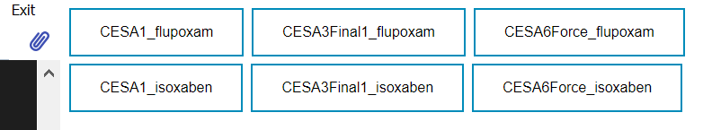
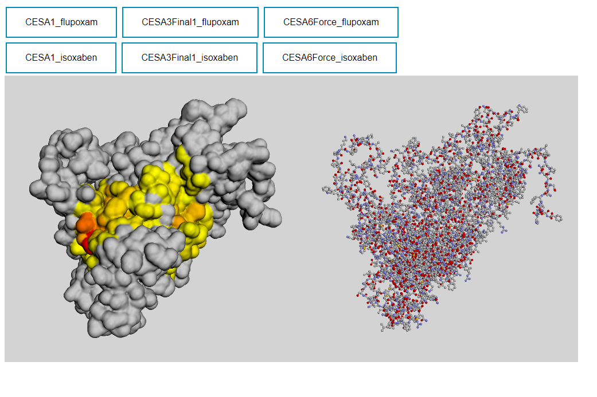

# public_html_BCB430

To see the visualization from the html.

1. Dowload/clone the whole public_html directory
If you clone it from github
 ``` 
git clone https://github.com/MichelleMengzhi/public_html_BCB430.git
 ``` 
 Or if you are viewing on the BAR, you should navigate to /home/yyu directory and 
 ``` 
scp ./public_html <your ip>
 ``` 


2. Copy CESA.html path to your browser

3. Each receptor_pair docking visualization result can be activated by respective button


4. Press each button to show the visualization. 

The left viewer shows the surface colored in heat map of the receptor.
<br> The color from red to orange to yellow represents the highest to the lowest contact frequency of the ligand to the receptor


The right viewer shows the receptor in ball and stick.

User can drag to see the 3D structure, and click on any atom to see its label.

Note that buttons with the same receptor name will overwrite the viewer window.
<br> For example, if you click __CESA1_isoxaben__ after clicking __CESA1_flupoxam__, then the viewer with the visualization of __CESA1_flupoxam__ will be reloaded to __CESA1_isoxaben__.

Updated:
<br>Add function to make the viewer can show atom after clicking or hovering the mouse on it. But the function is not completely work right now, which may due to the big size of the receptor, sometimes may click without label response or incorrect label.
